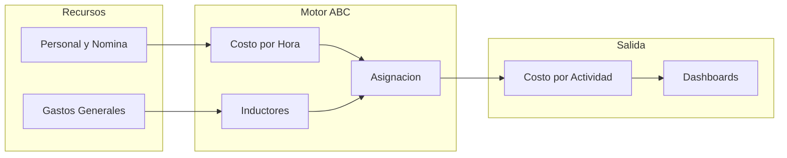
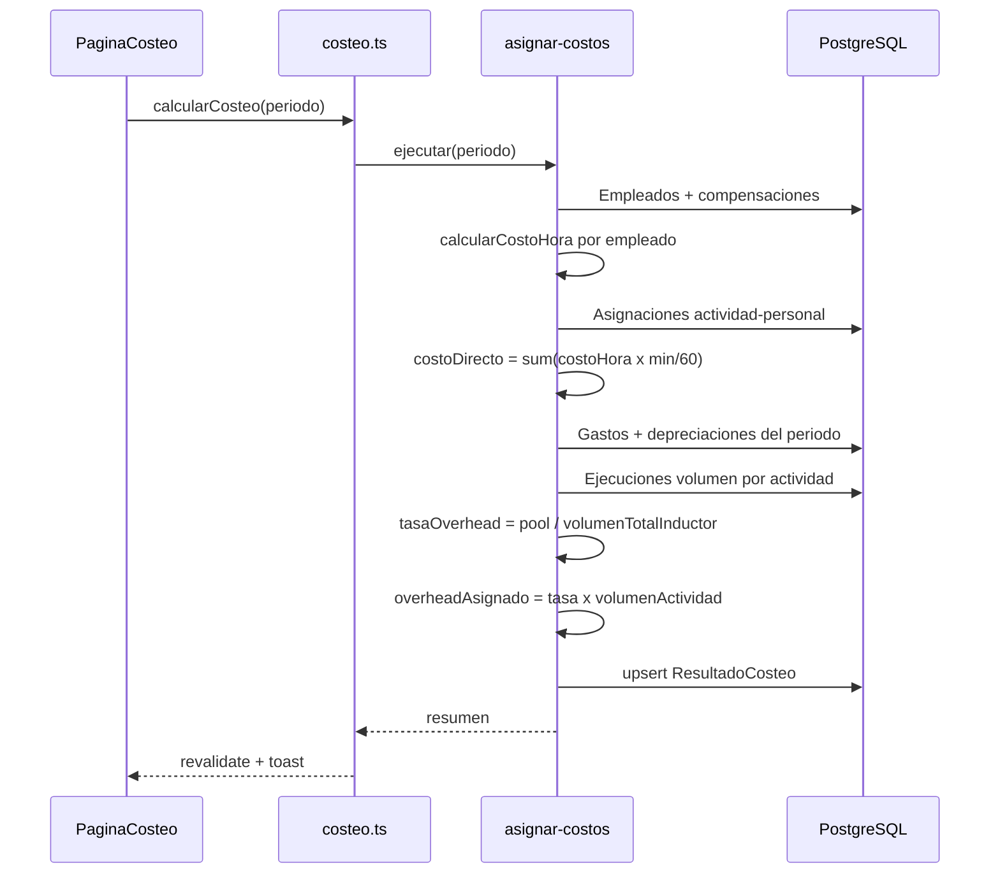

# PLANIFICACION_ABC.md — Sistema ABC Clínica

Documento de arquitectura y ejecución. **No se ejecutará ningún comando hasta tu aprobación explícita.** Tras aprobar, el primer paso será crear este archivo en la raíz del repo y comenzar la Fase 0.

---

## 1. Visión del sistema

El sistema modela el flujo ABC clásico adaptado a una clínica:



**Fórmulas clave del motor ABC:**

- `costoHoraEmpleado = (salarioAnual + beneficiosAnuales) / horasProductivasAnuales`
- `costoRecursoEnActividad = costoHora × minutosInvertidos / 60`
- `tasaInductor = costoPoolOverhead / volumenTotalInductor` (ej. $/minuto de triaje)
- `costoOverheadAsignado = tasaInductor × volumenActividad`
- `costoUnitarioActividad = costoDirectoPersonal + costoOverheadAsignado + costoMateriales`

---

## 2. Esquema de base de datos (Prisma)

Archivo principal: [`prisma/schema.prisma`](prisma/schema.prisma)

### 2.1 Enums

```prisma
enum RolEmpleado {
  MEDICO
  ENFERMERA
  ADMINISTRATIVO
  TECNICO
  LIMPIEZA
  OTRO
}

enum TipoGastoGeneral {
  ALQUILER
  DEPRECIACION
  SUMINISTROS
  SERVICIOS
  SEGUROS
  OTRO
}

enum TipoInductor {
  TIEMPO_MINUTOS      // minutos por paciente/procedimiento
  CANTIDAD_PACIENTES  // volumen de pacientes
  METROS_CUADRADOS    // espacio consumido
  NUMERO_EQUIPOS      // uso de equipos
  HORAS_MAQUINA       // tiempo de equipo
  CUSTOM
}

enum CategoriaActividad {
  CLINICA_DIRECTA     // Triaje, consulta, cirugía
  CLINICA_APOYO       // Laboratorio, imagenología
  OPERATIVA           // Mantenimiento quirófano, esterilización
  ADMINISTRATIVA      // Facturación, recepción
}

enum PeriodoFrecuencia {
  MENSUAL
  TRIMESTRAL
  ANUAL
}
```

### 2.2 Módulo RRHH y Nómina

| Modelo | Propósito |
|--------|-----------|
| `Departamento` | Áreas: Urgencias, Quirófano, Administración |
| `Empleado` | Datos personales, rol, departamento, estado activo |
| `EstructuraCompensacion` | Salario base, periodicidad, horas/semana, % beneficios |
| `Beneficio` | Ítems desglosados: seguro, bonos, aguinaldo prorrateado |
| `CostoHoraCalculado` | Snapshot histórico del costo/hora por empleado y periodo |

```prisma
model Departamento {
  id          String     @id @default(cuid())
  nombre      String     @unique
  descripcion String?
  empleados   Empleado[]
  createdAt   DateTime   @default(now())
  updatedAt   DateTime   @updatedAt
}

model Empleado {
  id              String                  @id @default(cuid())
  codigo          String                  @unique
  nombreCompleto  String
  rol             RolEmpleado
  departamentoId  String
  departamento    Departamento            @relation(fields: [departamentoId], references: [id])
  activo          Boolean                 @default(true)
  fechaIngreso    DateTime
  compensacion    EstructuraCompensacion?
  costosHora      CostoHoraCalculado[]
  asignaciones    AsignacionRecursoActividad[]
  createdAt       DateTime                @default(now())
  updatedAt       DateTime                @updatedAt
}

model EstructuraCompensacion {
  id                    String    @id @default(cuid())
  empleadoId            String    @unique
  empleado              Empleado  @relation(fields: [empleadoId], references: [id], onDelete: Cascade)
  salarioBase           Decimal   @db.Decimal(12, 2)
  moneda                String    @default("USD")
  horasSemanales        Decimal   @db.Decimal(5, 2)  // ej. 40.00
  semanasAnuales        Int       @default(48)        // descontando vacaciones
  porcentajeBeneficios  Decimal   @db.Decimal(5, 2)   // % sobre salario
  vigenteDesde          DateTime
  vigenteHasta          DateTime?
  beneficios            Beneficio[]
  createdAt             DateTime  @default(now())
  updatedAt             DateTime  @updatedAt
}

model Beneficio {
  id              String                 @id @default(cuid())
  compensacionId  String
  compensacion    EstructuraCompensacion @relation(fields: [compensacionId], references: [id], onDelete: Cascade)
  nombre          String                 // "Seguro médico", "Aguinaldo"
  montoAnual      Decimal                @db.Decimal(12, 2)
  createdAt       DateTime               @default(now())
}

model CostoHoraCalculado {
  id              String    @id @default(cuid())
  empleadoId      String
  empleado        Empleado  @relation(fields: [empleadoId], references: [id], onDelete: Cascade)
  periodo         String    // "2026-06" formato YYYY-MM
  costoHora       Decimal   @db.Decimal(10, 4)
  horasAnuales    Decimal   @db.Decimal(8, 2)
  costoAnualTotal Decimal   @db.Decimal(14, 2)
  calculadoEn     DateTime  @default(now())

  @@unique([empleadoId, periodo])
}
```

**Lógica de cálculo** (servicio [`lib/abc/calcular-costo-hora.ts`](lib/abc/calcular-costo-hora.ts)):

```
horasAnuales = horasSemanales × semanasAnuales
costoAnual = salarioBase × 12 (si mensual) + sum(beneficios.montoAnual) + salarioBase × (porcentajeBeneficios/100) × 12
costoHora = costoAnual / horasAnuales
```

### 2.3 Módulo Gastos Generales

| Modelo | Propósito |
|--------|-----------|
| `CentroCosto` | Pools de overhead: Instalaciones, Equipos, Administración |
| `GastoGeneral` | Registro de gastos periódicos |
| `ActivoDepreciable` | Equipos con vida útil y valor residual |
| `DepreciacionMensual` | Cuota mensual calculada por activo |

```prisma
model CentroCosto {
  id            String        @id @default(cuid())
  codigo        String        @unique
  nombre        String
  descripcion   String?
  gastos        GastoGeneral[]
  activos       ActivoDepreciable[]
  createdAt     DateTime      @default(now())
  updatedAt     DateTime      @updatedAt
}

model GastoGeneral {
  id              String           @id @default(cuid())
  centroCostoId   String
  centroCosto     CentroCosto      @relation(fields: [centroCostoId], references: [id])
  tipo            TipoGastoGeneral
  concepto        String
  monto           Decimal          @db.Decimal(14, 2)
  frecuencia      PeriodoFrecuencia
  fechaInicio     DateTime
  fechaFin        DateTime?
  activo          Boolean          @default(true)
  createdAt       DateTime         @default(now())
  updatedAt       DateTime         @updatedAt
}

model ActivoDepreciable {
  id                String              @id @default(cuid())
  centroCostoId     String
  centroCosto       CentroCosto         @relation(fields: [centroCostoId], references: [id])
  nombre            String              // "Monitor multiparamétrico"
  valorAdquisicion  Decimal             @db.Decimal(14, 2)
  valorResidual     Decimal             @db.Decimal(14, 2) @default(0)
  vidaUtilMeses     Int
  fechaAdquisicion  DateTime
  depreciaciones    DepreciacionMensual[]
  createdAt         DateTime            @default(now())
  updatedAt         DateTime            @updatedAt
}

model DepreciacionMensual {
  id          String            @id @default(cuid())
  activoId    String
  activo      ActivoDepreciable @relation(fields: [activoId], references: [id], onDelete: Cascade)
  periodo     String            // YYYY-MM
  monto       Decimal           @db.Decimal(12, 2)

  @@unique([activoId, periodo])
}
```

### 2.4 Módulo Actividades Médicas

| Modelo | Propósito |
|--------|-----------|
| `Actividad` | Catálogo de procesos clínicos y operativos |
| `RecursoActividad` | Materiales/consumibles directos por actividad (opcional Fase 1) |
| `AsignacionRecursoActividad` | Tiempo de personal en actividad (driver primario) |

```prisma
model Actividad {
  id                String              @id @default(cuid())
  codigo            String              @unique
  nombre            String
  descripcion       String?
  categoria         CategoriaActividad
  activa            Boolean             @default(true)
  inductores        InductorActividad[]
  asignaciones      AsignacionRecursoActividad[]
  ejecuciones       EjecucionActividad[]
  materiales        RecursoActividad[]
  createdAt         DateTime            @default(now())
  updatedAt         DateTime            @updatedAt
}

model RecursoActividad {
  id            String    @id @default(cuid())
  actividadId   String
  actividad     Actividad @relation(fields: [actividadId], references: [id], onDelete: Cascade)
  nombre        String    // "Kit sutura", "Reactivo lab"
  costoUnitario Decimal   @db.Decimal(10, 2)
  unidad        String    @default("unidad")
  createdAt     DateTime  @default(now())
}

model AsignacionRecursoActividad {
  id                  String    @id @default(cuid())
  actividadId         String
  actividad           Actividad @relation(fields: [actividadId], references: [id], onDelete: Cascade)
  empleadoId          String
  empleado            Empleado  @relation(fields: [empleadoId], references: [id])
  minutosPorEjecucion Decimal   @db.Decimal(8, 2)  // tiempo estándar
  esPrincipal         Boolean   @default(false)
  createdAt           DateTime  @default(now())
  updatedAt           DateTime  @updatedAt

  @@unique([actividadId, empleadoId])
}
```

### 2.5 Módulo Inductores y Ejecuciones

| Modelo | Propósito |
|--------|-----------|
| `Inductor` | Definición del driver (nombre, tipo, unidad) |
| `InductorActividad` | Vincula inductor ↔ actividad ↔ centro de costo overhead |
| `EjecucionActividad` | Registro real de volumen (pacientes atendidos, minutos) |
| `ResultadoCosteo` | Snapshot calculado por actividad/periodo |

```prisma
model Inductor {
  id          String           @id @default(cuid())
  codigo      String           @unique
  nombre      String
  tipo        TipoInductor
  unidad      String           // "minutos", "pacientes", "m²"
  descripcion String?
  actividades InductorActividad[]
  createdAt   DateTime         @default(now())
  updatedAt   DateTime         @updatedAt
}

model InductorActividad {
  id              String       @id @default(cuid())
  inductorId      String
  inductor        Inductor     @relation(fields: [inductorId], references: [id])
  actividadId     String
  actividad       Actividad    @relation(fields: [actividadId], references: [id], onDelete: Cascade)
  centroCostoId   String?      // pool de overhead a asignar
  centroCosto     CentroCosto? @relation(fields: [centroCostoId], references: [id])
  pesoAsignacion  Decimal      @db.Decimal(5, 2) @default(100) // % del pool
  createdAt       DateTime     @default(now())

  @@unique([inductorId, actividadId])
}

model EjecucionActividad {
  id              String    @id @default(cuid())
  actividadId     String
  actividad       Actividad @relation(fields: [actividadId], references: [id])
  periodo         String    // YYYY-MM
  volumen         Decimal   @db.Decimal(12, 2)  // pacientes o minutos totales
  notas           String?
  registradoEn    DateTime  @default(now())

  @@index([actividadId, periodo])
}

model ResultadoCosteo {
  id                    String    @id @default(cuid())
  actividadId           String
  actividad             Actividad @relation(fields: [actividadId], references: [id])
  periodo               String
  costoDirectoPersonal  Decimal   @db.Decimal(14, 2)
  costoOverhead         Decimal   @db.Decimal(14, 2)
  costoMateriales       Decimal   @db.Decimal(14, 2)
  costoTotal            Decimal   @db.Decimal(14, 2)
  costoUnitario         Decimal   @db.Decimal(14, 4)
  volumen               Decimal   @db.Decimal(12, 2)
  margenReferencia      Decimal?  @db.Decimal(14, 2)  // ingreso - costo (fase dashboard)
  calculadoEn           DateTime  @default(now())

  @@unique([actividadId, periodo])
}
```

**Nota Supabase/Vercel:** en [`prisma/schema.prisma`](prisma/schema.prisma) usar `directUrl` para migraciones y `url` con pooler (port 6543) para runtime:

```prisma
datasource db {
  provider  = "postgresql"
  url       = env("DATABASE_URL")
  directUrl = env("DIRECT_URL")
}
```

---

## 3. Estructura de carpetas (Next.js App Router)

```
e:\Sistema ABC Clinica\
├── prisma/
│   ├── schema.prisma
│   ├── seed.ts                    # Actividades + datos demo realistas
│   └── migrations/
├── public/
│   └── logo.svg
├── src/
│   ├── app/
│   │   ├── layout.tsx             # Root: fonts, ThemeProvider, Toaster
│   │   ├── page.tsx               # Redirect → /dashboard
│   │   ├── globals.css
│   │   ├── (dashboard)/           # Route group — shell compartido
│   │   │   ├── layout.tsx         # Sidebar + header animado
│   │   │   ├── dashboard/
│   │   │   │   └── page.tsx       # KPIs Tremor + gráficos Recharts
│   │   │   ├── recursos-humanos/
│   │   │   │   ├── page.tsx       # Lista empleados
│   │   │   │   ├── nuevo/page.tsx
│   │   │   │   └── [id]/page.tsx  # Detalle + compensación
│   │   │   ├── gastos-generales/
│   │   │   │   ├── page.tsx
│   │   │   │   ├── activos/page.tsx
│   │   │   │   └── nuevo/page.tsx
│   │   │   ├── actividades/
│   │   │   │   ├── page.tsx       # Catálogo
│   │   │   │   └── [id]/page.tsx  # Inductores + asignaciones
│   │   │   ├── inductores/
│   │   │   │   └── page.tsx
│   │   │   ├── ejecuciones/
│   │   │   │   └── page.tsx       # Registro volumen mensual
│   │   │   └── costeo/
│   │   │       └── page.tsx       # Ejecutar cálculo ABC + resultados
│   │   └── api/                   # Route handlers (si no usamos solo Server Actions)
│   │       └── costeo/
│   │           └── calcular/route.ts
│   ├── components/
│   │   ├── ui/                    # Shadcn (button, card, table, dialog…)
│   │   ├── layout/
│   │   │   ├── app-sidebar.tsx
│   │   │   ├── page-header.tsx
│   │   │   └── motion-wrapper.tsx # Framer Motion HOC
│   │   ├── charts/
│   │   │   ├── kpi-cards.tsx      # Tremor Metric, Card
│   │   │   ├── cost-breakdown-chart.tsx   # Recharts Pie/Bar
│   │   │   └── profitability-chart.tsx
│   │   ├── forms/
│   │   │   ├── empleado-form.tsx
│   │   │   ├── gasto-form.tsx
│   │   │   └── ejecucion-form.tsx
│   │   └── tables/
│   │       ├── data-table.tsx     # TanStack Table + Shadcn
│   │       └── columns/
│   ├── lib/
│   │   ├── prisma.ts              # Singleton PrismaClient
│   │   ├── utils.ts               # cn(), formatCurrency()
│   │   ├── abc/
│   │   │   ├── calcular-costo-hora.ts
│   │   │   ├── calcular-overhead.ts
│   │   │   ├── asignar-costos.ts  # Motor ABC principal
│   │   │   └── types.ts
│   │   ├── validations/
│   │   │   ├── empleado.schema.ts # Zod
│   │   │   ├── gasto.schema.ts
│   │   │   └── actividad.schema.ts
│   │   └── constants/
│   │       └── navigation.ts
│   ├── actions/                   # Server Actions
│   │   ├── empleados.ts
│   │   ├── gastos.ts
│   │   ├── actividades.ts
│   │   ├── ejecuciones.ts
│   │   └── costeo.ts
│   └── hooks/
│       └── use-media-query.ts
├── .env.example
├── .env.local                     # gitignored
├── next.config.ts
├── tailwind.config.ts
├── components.json                # Shadcn config
├── PLANIFICACION_ABC.md           # Este documento
├── package.json
└── vercel.json                    # Opcional: región, cron futuro
```

---

## 4. Diseño UI/UX

### 4.1 Principios visuales

- **Estética:** minimalista clínica — fondo `slate-50`, tarjetas blancas con `shadow-sm` y `rounded-xl`, acento teal/emerald (`#0d9488`) para acciones primarias.
- **Tipografía:** `Inter` (UI) + `JetBrains Mono` opcional para cifras financieras.
- **Espaciado:** generoso padding en páginas (`p-6 lg:p-8`), grids de 12 columnas en dashboard.
- **Motion:** Framer Motion con `layoutId` en navegación, `AnimatePresence` en modales, stagger en listas (150ms, ease `[0.25, 0.1, 0.25, 1]`).
- **Componentes:** Shadcn Table, Dialog, Sheet (formularios laterales), Badge para categorías de actividad.

### 4.2 Mapa de pantallas MVP

| Ruta | Contenido |
|------|-----------|
| `/dashboard` | 4 KPIs Tremor (costo total, costo/paciente prom., actividad más costosa, overhead %) + Recharts stacked bar por categoría |
| `/recursos-humanos` | CRUD empleados, badge costo/hora calculado |
| `/gastos-generales` | Tabs: Gastos recurrentes \| Activos depreciables |
| `/actividades` | Grid de cards con código, categoría, costo unitario último periodo |
| `/inductores` | Matriz actividad ↔ inductor ↔ centro costo |
| `/ejecuciones` | Formulario bulk por periodo |
| `/costeo` | Botón "Calcular periodo", tabla resultados exportable |

### 4.3 Wireframe conceptual (dashboard)

```
┌─────────────────────────────────────────────────────────┐
│ [Logo ABC Clínica]     Dashboard          Jun 2026  ▼  │
├──────────┬──────────────────────────────────────────────┤
│ Recursos │  ┌─────┐ ┌─────┐ ┌─────┐ ┌─────┐            │
│ Gastos   │  │ KPI │ │ KPI │ │ KPI │ │ KPI │  Tremor   │
│ Activ.   │  └─────┘ └─────┘ └─────┘ └─────┘            │
│ Induct.  │  ┌──────────────────┐ ┌─────────────────┐  │
│ Ejecuc.  │  │ Costo por        │ │ Rentabilidad    │  │
│ Costeo   │  │ Actividad (Bar)  │ │ por Categoría   │  │
│          │  └──────────────────┘ └─────────────────┘  │
└──────────┴──────────────────────────────────────────────┘
```

---

## 5. Script seed — actividades realistas

Archivo: [`prisma/seed.ts`](prisma/seed.ts)

Poblará automáticamente:

**Departamentos:** Urgencias, Quirófano, Laboratorio, Administración, Mantenimiento.

**Actividades (15+ ejemplos):**

| Código | Nombre | Categoría | Minutos std. |
|--------|--------|-----------|--------------|
| ACT-001 | Triaje de Urgencias | CLINICA_DIRECTA | 12 |
| ACT-002 | Consulta Médica General | CLINICA_DIRECTA | 25 |
| ACT-003 | Cirugía Menor Ambulatoria | CLINICA_DIRECTA | 90 |
| ACT-004 | Curación y Vendaje | CLINICA_DIRECTA | 15 |
| ACT-005 | Toma de Muestras Lab | CLINICA_APOYO | 8 |
| ACT-006 | Análisis Hematológico | CLINICA_APOYO | 20 |
| ACT-007 | Radiografía Simple | CLINICA_APOYO | 10 |
| ACT-008 | Mantenimiento de Quirófano | OPERATIVA | 45 |
| ACT-009 | Esterilización de Instrumental | OPERATIVA | 30 |
| ACT-010 | Limpieza de Área Crítica | OPERATIVA | 25 |
| ACT-011 | Admisión de Paciente | ADMINISTRATIVA | 10 |
| ACT-012 | Facturación y Cobro | ADMINISTRATIVA | 12 |
| ACT-013 | Gestión de Inventario | ADMINISTRATIVA | 60 |
| ACT-014 | Monitoreo Preoperatorio | CLINICA_DIRECTA | 20 |
| ACT-015 | Infusión IV y Medicación | CLINICA_DIRECTA | 18 |

**También incluirá:** 8 empleados demo, 5 gastos generales, 3 activos depreciables, inductores de tiempo, ejecuciones del mes actual y un cálculo ABC inicial.

Comando en `package.json`:

```json
"prisma": {
  "seed": "tsx prisma/seed.ts"
}
```

---

## 6. Motor ABC — algoritmo de asignación

Implementación en [`lib/abc/asignar-costos.ts`](lib/abc/asignar-costos.ts):



---

## 7. Plan de ejecución paso a paso

### Fase 0 — Documentación y setup (Día 1)
1. Crear [`PLANIFICACION_ABC.md`](PLANIFICACION_ABC.md) en raíz (este documento).
2. `npx create-next-app@latest` con TypeScript, Tailwind, App Router, `src/` dir.
3. Instalar dependencias: `prisma`, `@prisma/client`, `zod`, `react-hook-form`, `@hookform/resolvers`, `framer-motion`, `@tremor/react`, `recharts`, `@tanstack/react-table`, `date-fns`, `lucide-react`.
4. Inicializar Shadcn UI (`npx shadcn@latest init`) — estilo **New York**, base color **slate**, CSS variables.
5. Configurar `.env.example` con `DATABASE_URL` y `DIRECT_URL`.

### Fase 1 — Base de datos (Día 1-2)
6. `npx prisma init` — pegar schema completo de sección 2.
7. Crear [`lib/prisma.ts`](src/lib/prisma.ts) singleton (patrón recomendado para serverless/Vercel).
8. Escribir [`prisma/seed.ts`](prisma/seed.ts) con actividades realistas.
9. Migración inicial + seed local (PostgreSQL local o Supabase dev).

### Fase 2 — Layout y navegación (Día 2)
10. Shell dashboard: sidebar colapsable, header con selector de periodo global.
11. Componentes `motion-wrapper`, `page-header`, tema claro por defecto.
12. [`lib/constants/navigation.ts`](src/lib/constants/navigation.ts) — ítems del menú.

### Fase 3 — Módulo RRHH (Día 3)
13. Schemas Zod + Server Actions CRUD empleados/compensación.
14. Páginas lista, crear, editar con formularios Shadcn.
15. Servicio `calcular-costo-hora.ts` — recalcular al guardar compensación.

### Fase 4 — Gastos Generales (Día 3-4)
16. CRUD gastos y centros de costo.
17. CRUD activos depreciables + cálculo automático cuota mensual.
18. Vista resumen pool overhead por periodo.

### Fase 5 — Actividades e Inductores (Día 4-5)
19. Catálogo actividades (grid cards animadas).
20. Detalle actividad: asignación personal (minutos) + inductores.
21. Página matriz de inductores.

### Fase 6 — Ejecuciones y Motor ABC (Día 5-6)
22. Registro de volumen mensual por actividad.
23. Implementar `asignar-costos.ts` completo.
24. Página `/costeo` con botón calcular y tabla de resultados.

### Fase 7 — Dashboards (Día 6-7)
25. KPI cards con Tremor (`Metric`, `BadgeDelta`).
26. Gráficos Recharts: barras apiladas costo directo vs overhead, pie por categoría.
27. Tabla top/bottom actividades por rentabilidad.

### Fase 8 — Pulido y despliegue Vercel (Día 7-8)
28. Loading skeletons, error boundaries, empty states.
29. Optimizar queries Prisma (`include` selectivos).
30. Crear proyecto Supabase → obtener URLs → configurar en Vercel Environment Variables.
31. `vercel deploy` — build command estándar; post-deploy: `npx prisma migrate deploy` (CI o manual).
32. Smoke test en producción.

### Fase 9 — Post-MVP (futuro, no incluido en MVP)
- Autenticación (NextAuth o Supabase Auth) con roles.
- Export PDF/Excel de reportes.
- Comparativa multi-periodo.
- Ingresos por actividad para margen real.

---

## 8. Configuración Vercel / Supabase

| Variable | Uso |
|----------|-----|
| `DATABASE_URL` | Pooler Supabase (puerto 6543, `?pgbouncer=true`) |
| `DIRECT_URL` | Conexión directa para migraciones (puerto 5432) |

**Consideraciones serverless:**
- Prisma Client singleton en [`lib/prisma.ts`](src/lib/prisma.ts).
- Server Actions preferidas sobre API routes para mutaciones (menos cold starts perceived).
- Evitar cálculos ABC en middleware; solo en Server Actions bajo demanda.

---

## 9. Dependencias principales (referencia)

```json
{
  "dependencies": {
    "next": "^15",
    "react": "^19",
    "@prisma/client": "latest",
    "@tremor/react": "latest",
    "recharts": "latest",
    "framer-motion": "latest",
    "zod": "latest",
    "react-hook-form": "latest",
    "@tanstack/react-table": "latest",
    "date-fns": "latest",
    "lucide-react": "latest"
  },
  "devDependencies": {
    "prisma": "latest",
    "tsx": "latest",
    "typescript": "latest"
  }
}
```

---

## 10. Criterios de aceptación del MVP

- [ ] Seed ejecuta sin errores y muestra 15+ actividades clínicas realistas.
- [ ] CRUD completo de empleados con costo/hora calculado automáticamente.
- [ ] Registro de gastos generales y depreciación de equipos.
- [ ] Asignación de personal e inductores a actividades.
- [ ] Motor ABC calcula `ResultadoCosteo` por periodo.
- [ ] Dashboard con KPIs Tremor y al menos 2 gráficos Recharts.
- [ ] UI limpia, responsive, animaciones sutiles con Framer Motion.
- [ ] Deploy exitoso en Vercel conectado a Supabase PostgreSQL.

---

## Próximo paso tras tu aprobación

1. Escribir [`PLANIFICACION_ABC.md`](PLANIFICACION_ABC.md) en la raíz del workspace.
2. Ejecutar Fase 0: scaffolding Next.js + Prisma + Shadcn.

**Confirma este plan** (o indica ajustes al schema, actividades seed, o prioridades de fases) para comenzar la implementación.
